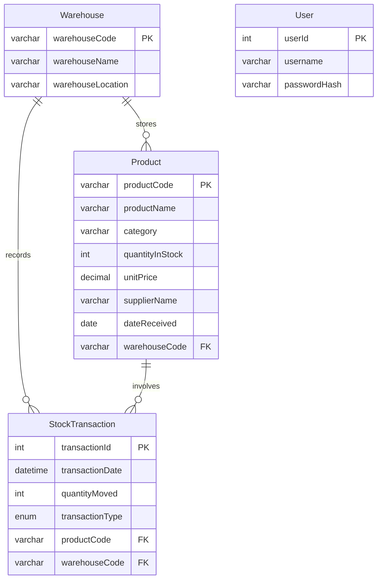

# Entity Relationship Diagram (ERD)
## Stock Management System (SMS) — StockHub Ltd

> **Note:** Draw this diagram on plain paper first, then reproduce in draw.io, Lucidchart, or Edraw Max using Crow's Foot notation.

---

## Entities & Attributes

### 1. Product
| Attribute | Type | Key |
|-----------|------|-----|
| productCode | VARCHAR(20) | **PK** |
| productName | VARCHAR(100) | |
| category | VARCHAR(50) | |
| quantityInStock | INT | |
| unitPrice | DECIMAL | |
| supplierName | VARCHAR(100) | |
| dateReceived | DATE | |
| warehouseCode | VARCHAR(20) | **FK** → Warehouse |

### 2. Warehouse
| Attribute | Type | Key |
|-----------|------|-----|
| warehouseCode | VARCHAR(20) | **PK** |
| warehouseName | VARCHAR(100) | |
| warehouseLocation | VARCHAR(150) | |

### 3. StockTransaction
| Attribute | Type | Key |
|-----------|------|-----|
| transactionId | INT | **PK** (surrogate) |
| transactionDate | DATETIME | |
| quantityMoved | INT | |
| transactionType | ENUM('IN','OUT') | |
| productCode | VARCHAR(20) | **FK** → Product |
| warehouseCode | VARCHAR(20) | **FK** → Warehouse |

### 4. User (authentication)
| Attribute | Type | Key |
|-----------|------|-----|
| userId | INT | **PK** |
| username | VARCHAR(50) | UNIQUE |
| passwordHash | VARCHAR(255) | |

---

## Relationships & Cardinalities

```
┌─────────────┐         ┌──────────────────┐         ┌─────────────┐
│  Warehouse  │ 1     * │ StockTransaction │ *     1 │   Product   │
│             │─────────│                  │─────────│             │
│ warehouseCode│         │ transactionId   │         │ productCode │
└─────────────┘         └──────────────────┘         └─────────────┘
       │                                                      │
       │ 1                                                    │
       │                                                      │
       │ * (stores inventory)                                 │
       └──────────────────────────────────────────────────────┘
                    Product.warehouseCode → Warehouse
```

| Relationship | Cardinality | Description |
|--------------|-------------|-------------|
| Warehouse — StockTransaction | **1 : N** | One warehouse has many transactions |
| Product — StockTransaction | **1 : N** | One product has many transactions |
| Warehouse — Product | **1 : N** | One warehouse holds many products |

---

## Mermaid Diagram (for digital reproduction)



---

## Business Rules

1. **productCode** and **warehouseCode** are natural primary keys.
2. **transactionId** is an auto-increment surrogate primary key for StockTransaction.
3. Stock **IN** transactions increase `Product.quantityInStock`.
4. Stock **OUT** transactions decrease `Product.quantityInStock` (cannot go below zero).
5. Each product is assigned to exactly one warehouse at registration time.
